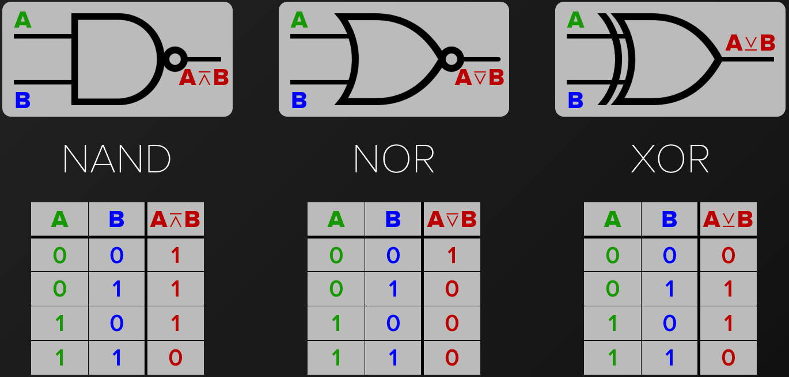
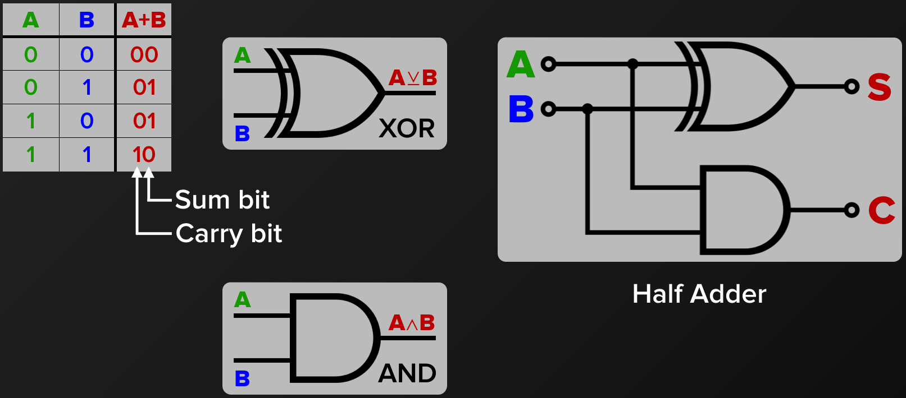
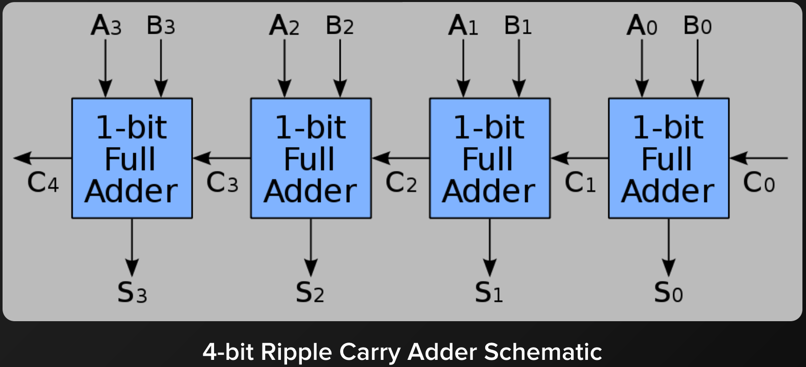
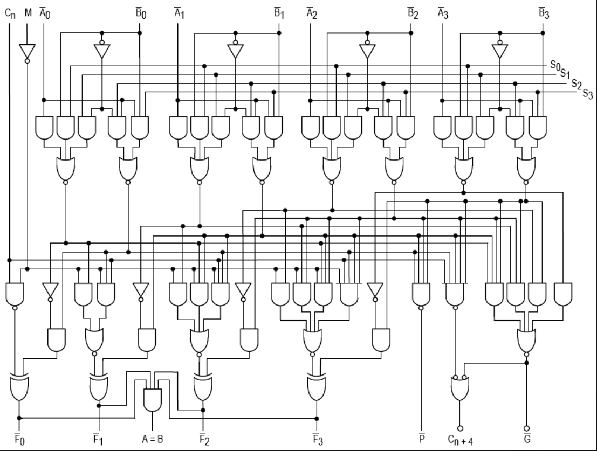
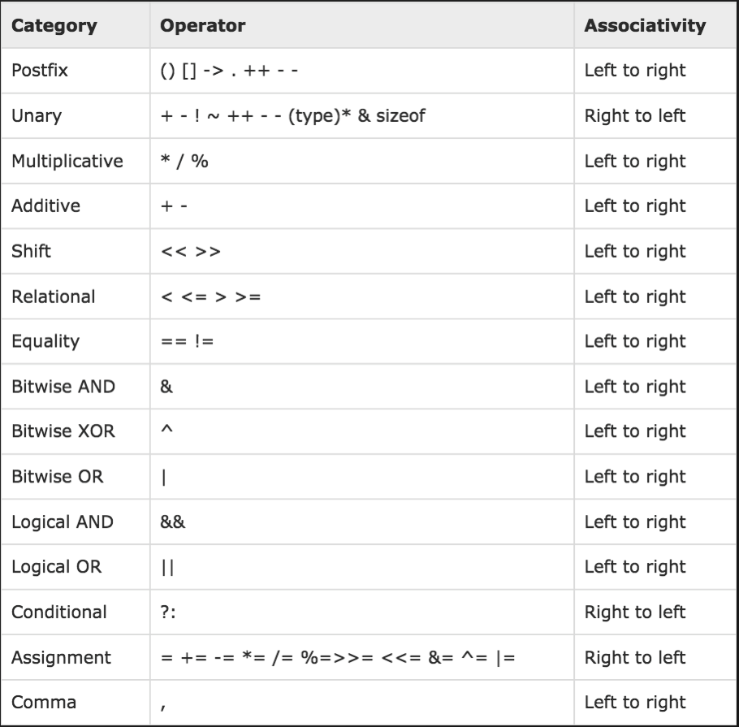

# C / C++ Programming Class 1

## Objectives

- **Review Von Neumann computer architecture**
- **Identify and describe components and operation of a CPU (Central Processing Unit)**
- **Identify and describe components and operation of an ALU (Arithmetic Logic Unit)**
- **Identify and use C Language Fundamental Features**

---
# CPU Architecture
### Instruction set – what a CPU is capable of doing (in machine code or assembly)
### Microarchitecture – how an instruction set is implemented on a CPU (in digital circuitry)
---
# CPU Components
### Clock – sets pace of execution with circuit voltages
### Registers – memory cells with data to be manipulated
### Datapath – executes operations on data in registers
### Control unit* – decodes instructions into opcode + operands
#### * may decompose complex operations into simpler ones according to microprograms)

---
# CPU Organization

### Abstract (simplified) model of a CPU
---
# CPU Operation Loop
### Fetch instruction from memory (or cache)
### Decode instruction into opcode + operands (may require fetching data from memory)
### Execute instruction on data in registers (results stored in registers and/or memory)
---
# CPU Instructions
### Instructions written in machine code – 0s and 1s
### Single word (typically 32 or 64 bits) encodes:
### Opcode – specifies operation to execute
### Operands – data to execute operation on may be value, register, or memory address
---
# CPU Instruction Types
### Arithmetic – add, subtract, multiply, divide
### Logical – and, or, invert (bitwise); shift, rotate
### Branch – conditional (if-then-else), loop, function
### Memory – load (read), store (write)
### Complex instructions are written as microprograms of other instructions (e.g., multiply = shifts + adds)
---
# CPU Instruction Sets
### Complex instruction set computing (CISC) – each instruction can execute several operations
#### Intel (Pentium, Core), AMD (Athlon, Phenom)
### Reduced instruction set computing (RISC) – fewer instructions; can be higher performance
#### ARM (mobile), MIPS, SPARC (supercomputers)
---
# Addressing Modes
### Direct – operand specifies register containing data
```c
sum = x + y;  // add reg. 1 to reg. 2, store in reg. 3
```
### Indirect – operand specifies memory address of data
```c
data = *ptr;  // load memory address ptr, store in reg. 1
```
### Indexed – operands specify base memory address and offset of data
```c
value = a[i];   // load memory address a + i, store in reg. 1
```
### Immediate – operand is numerical value (actual data)
```c
x = x + 5;   // load x into reg. 1, add reg. 1 to 5, store in reg. 1
```
---
# CPU Datapath
### Functional blocks made of Boolean logic gates – hardware circuits that propagate high/low voltage
### Arithmetic logic unit (ALU) – performs actual arithmetic calculations, bitwise logic, and bit shifts
### I/O registers – store current instruction, address of next instruction, and address to load/store data
---
# Boolean Logic Gates



---
# Adding Two Bits

# Adding More Bits

# Ripple Carry Adder Schematics

# Four Bit ALU


---
### 5 Minute Break
---
# C Language Fundamental Functionality and Features
### Variables, Types and Defines
### Functions, Blocks and Parenthesis
### Arithmetic and Logical Operators
### Bitwise Logical Operators
### Operator Precedence Rules
### Arrays
### Multidimensional Arrays
---
# Variables, Types and Defines
### Variables must start with a letter and can include underbar and numerals:
```c
Counter, Index, x, i, j, k    (are sometimes used)

ListOfUserNames, ServoPositions, StateOfAccount (are much better variable names)
```
### Types are:  (signed and unsigned charactes, integers and floating point numbers) as well as library and user defined types which we’ll cover later
```c
void, char, int, long, long long, unsigned char, unsigned int, float, double
```
### Putting constants in code is usually done using:
```c
#define CONSTANT_VALUE = 45
```
### Defining constants using floating point, integer decimal, hexadecimal and binary notation
```c
#define FLOATING_POINT = 3.14159  // Pi
#define INTEGER_VALUE  = 123456
#define HEXADECIMAL    = 0x03FA902B
#define BINARY         = 0b01011010  // = 0x5A
```
---
# Functions, Blocks and Parenthesis
### Functions must start with a letter and can include underbar and numerals.  Functions can return a single result and take multiple parameters of any type:
```c
foo, bar and myFunction   (are sometimes used)
ComputeAngle, ParseText, ScanString (are much better function names)
```
### Example function definitions:
```c
void doSomething (void) { ; }
bool Scan (char text[], char key[] ) { ; }
```
---
# Arithmetic Operators
### C language includes all common math operations on all intrinsic data types:
```c
 + - * / %   (add, subtract, multiply, divide and modulo)
```
and advanced math such as sin, cosine, exponents, square root and others through math library functions:

```c
AngleOfServo = sin( NewAngle );
```

---
# Logical Operators
### C language includes all common logical operations on all intrinsic data types:
```c
 && || !  (AND, OR, NOT)
```
### An example of logical operators:
```c
int this = true;
int that = true;
int NotThisAndThat = ! (This && That);
```
# Bitewise Logical Operators
### C language includes all common bitwise logical operations on all integer data types:
```c
 & | ^ ~  (AND, OR, XOR, NOT)
```
### and related shift operators:
```c
<< >>  (LEFT SHIFT, RIGHT SHIFT)
```
```c
int MyValue = 0b00111110; // 0x3e
int ShiftAndMask = 0b0111000 & (MyValue << 3);
```
<script src="//repl.it/embed/Iujt/3.js"></script>

---
# Precedence Rules
### C/C++ language includes mathematical precedence rules.  Use them with care.  Most software engineers use explicit parenthesis to make code more maintainable and clear to all readers.


---
# Arrays
### C language supports extensive array capability:
```c
int Items[] = {5, 3, 11};  (a 3 element array of ints)
```
### It is not required to specify the number of elements in brackets but this is often done to ensure correctness:
```c
#define NUM_ELEMENTS 3
int Items[NUM_ELEMENTS] = {5, 3, 11};
```

---
# Multi Dimensional Arrays
### C language supports multi dimensional array capability:
```c
#define GROUPS 2
#define NUM_ELEMENTS 3

int Items[GROUPS] [NUM_ELEMENTS] =
{ {5,  3, 11},
  {99, 7, 45} };
printf(”# at 2,3 = %d\n”, Items[1] [2] );
```
<script src="//repl.it/embed/IulF/1.js"></script>

---
