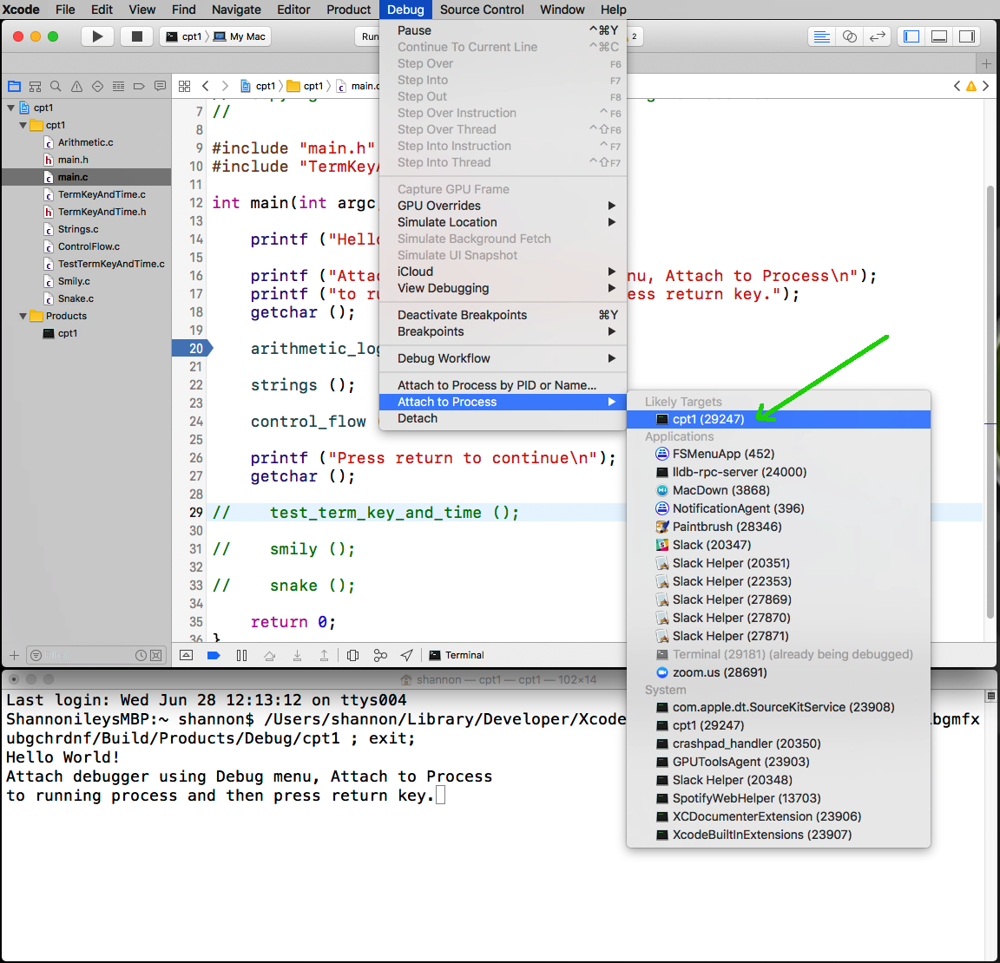
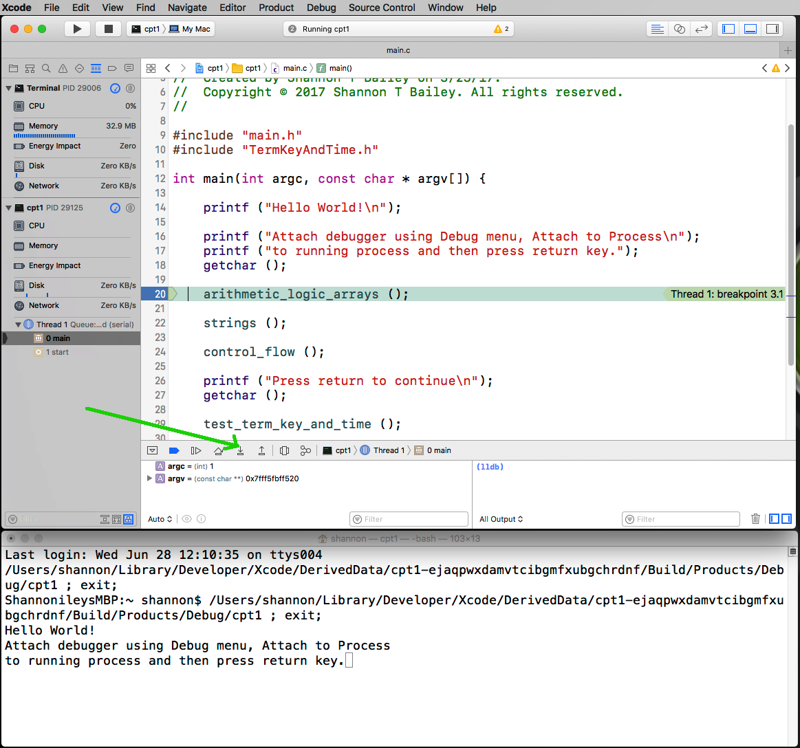
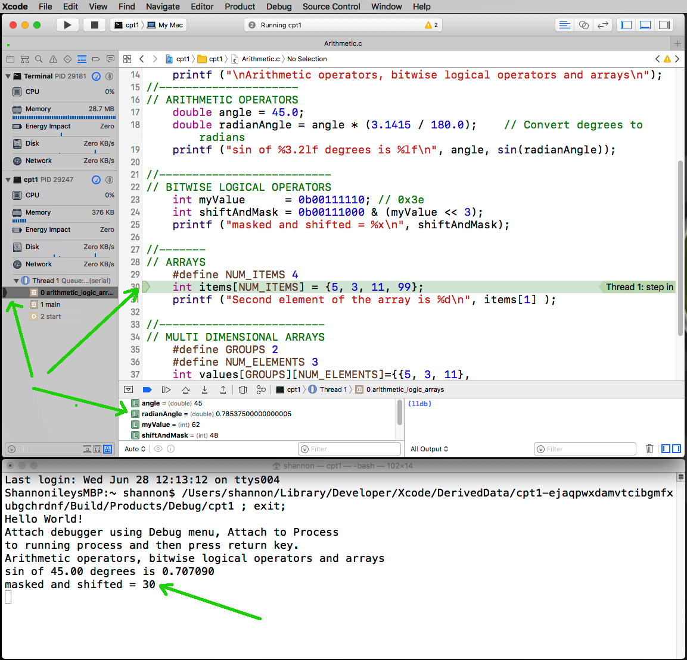
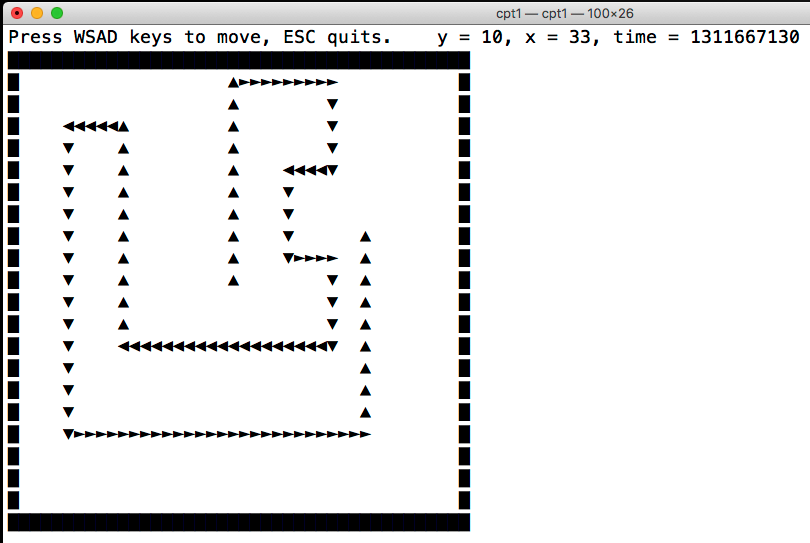

# C / C++ Programming Class 2

---
# C Language Fundamental Functionality and Features

## Objectives

- **Identify and use essential C language features that provide text and data input, output and processing using iteration**
- **Describe differences between and use both ASCII and Unicode character strings**
- **Master For loops and conditionals**
- **Master While loops and Switch statements**
- **Use Standard C Libraries**

---
# ASCII Strings
### Strings in C are stored as arrays of bytes encoded using ASCII or Unicode with a binary zero (NULL) terminator:
```c
main () {
  char rock[] = "C Programmers Rock";  
  printf ("%s\n", rock);

  printf ("String Length = %lu\n",    strlen(rock) );
    
  printf ("specific letters in hexadecimal\n");
  printf ("First letter  = 0x%02x\n", rock[0] );
  printf ("Last letter   = 0x%02x\n", rock[strlen(rock) - 1] );
  printf ("NULL at end   = 0x%02x\n", rock[strlen(rock)] );
}
```
<script src="//repl.it/embed/IpS6/1.js"></script>

---
# Unicode Strings
### Unicode strings in C are stored as arrays of bytes encoded typically using UTF-8 with a binary zero (NULL) terminator:
```c
main () {
  char unicode[] = "\U0001F60A \u03C6 \u221A \u2467";
  printf("Some unicode %s characters\n", unicode);
}
```
<script src="//repl.it/embed/IpTg/2.js"></script>

Note: Support for UTF-8, UTF-16 and UTF-32 is not identical on different operating systems and also require using special string functions

---
# for loops and conditionals
### C provides excellent iteration and conditional control structures using for and if, else:
```c
#define ITEMS 5
main () {
  double sum = 0.0;
  double values[ITEMS] = {4.95, 7.50, 3.95, 2.15, 9.99};
 
  for (int x = 0; x < ITEMS; x++) {
    if (x == 0) {
      printf ("Item costs $%0.2lf", values[x]);
    } else {
      printf (" + $%0.2lf", values[x])
    }
    sum += values[x];
  }
  printf (" = Total $%0.2lf\n", sum);
}
```
<script src="//repl.it/embed/IpUE/1.js"></script>

---
# Ternary Expressions
### C provides ternary (three part) expressions that can concisely replace many multi line if, else expressions:
### value\_assigned = boolean ? value\_if\_true : value\_if\_false;
```c
#include <stdbool.h>
 
// only left or right pin can be true for a joystick
// uses two ternary expressions on one line for conciseness
void get_angle (bool leftPin, bool rightPin) {
  int angle = leftPin ? -30 : (rightPin ? 30 : 0);
  printf ("leftPin = %d, rightPin = %d,", leftPin, rightPin);
  printf (" angle = %d\n", angle);
}

main () {
  get_angle ( false, false );
  get_angle ( true,  false );
  get_angle ( false, true  );
}
```
<script src="//repl.it/embed/IuXe/2.js"></script>

---
# While Loops
### C provides convenient looping controlled by conditional:
### while (condition) { … }  _or_  do { … } while (condition);
```c
#include <time.h>

main () {
time_t oldTime, newTime;
int count = 0;
 
  time ( &oldTime ); // pass time variables to time function by
  oldTime += 2;      // reference ‘&’ so they can be modified
  do {
    time ( &newTime );
    count++;
  }
  while (oldTime > newTime);
  printf ("count reached %d in 2 seconds\n", count);
}
```
<script src="//repl.it/embed/IuYV/2.js"></script>

---
# Switch Statements
### The switch statement provides a easy way of having various code sections run based on a variables value:
### switch (value) { case 1: code; case 2: code; default: code}
```c
void check (char letter) {
  switch (letter) {
    case 'A': printf ("Letter A seen\n");
      break;
    case 'B': printf ("Letter B seen\n");
      break;
    default: printf ("Bad letter \"%c\" seen\n", letter);
  }
}

main () {
  check ('A');
  check ('B');
  check ('Z');
}
```
<script src="//repl.it/embed/IuYt/1.js"></script>

---
# Goto Statements
### The goto statement is a much maligned way to cause code execution to jump to a new location in a function:
### goto lineLable;
### lineLabel: code;
```c
main () {
  goto firstLabel;
  
  printf ("Unreachable code");
  
firstLabel:
  printf ("Destination first label\n");
  goto thirdLabel;

secondLabel:
  printf ("Destination second label\n");
  goto fourthLabel;

thirdLabel:
  printf ("Destination third label\n");
  goto secondLabel;

fourthLabel:
  printf ("Destination fourth label\n");
  printf ("Last goto reached\n");
}
```
<script src="//repl.it/embed/IuZM/2.js"></script>
---

# How To Setup The Command Line Terminal App
### Xcode programs can be created that do not use a graphical window for user interaction and will use the Terminal application found in the Utilities folder inside the Applications folder.  Due to a problem with permissions in the latest Sierra OS/X version, to have Xcode launch the Terminal application when your program runs you have to make a copy of the application and then rename it to Terminal2.app.  When using the curriculum Xcode projects or your own new command line projects, follow the instructions below in Xcode.  Copy Terminal and rename only once.  The Terminal application is found in the Utilities folder under the Applications folder.
### Again, it is best to configure the Terminal2 application to use the Menlo 18pt Regular font and normal background and foreground colors for the numerous terminal programs to work properly for the rest of this class.


---
# How To Run and Debug Programs
### Launch Xcode, then load ***cpt1*** project and configure the terminal as described in the section on setting up the Terminal2 app.  Explore the cpt1 Xcode project main.c file and Arithmetic.c, Strings.c and ControlFlow.c files.  Note that main.c includes function calls several additional projects that we'll be exploring shortly.
### When Xcode is configured to produce a command line application and the Terminal2 app is setup to launch and interact with your programs process, you can set breakpoints and single step through the program.  The debugger will pause the program execution so you can inspect variables and other program state.  The blue mark on line 20, is a breakpoint.
### By pressing the right pointing triangle under the word edit in the menu bar, Xcode will compile and run the program.

### Because the program is a command line program and not a GUI OS/X application, we have to help Xcode attach its debugger to the running process, which is paused waiting for the user to press the return key.  So before pressing the return key in the Terminal2 application window that popped up once the program began running, selected the Debug menu, then the submenu item Attach To Process, then selecte the top item which is the running program.  Then press return in the program waiting which is waiting for a user keystroke.

### Now that the debugger has paused the program, press the down pointing arrow that points to a horizontal bar in the lower debugger bar section.  This button is the single step command that will step into the arithmetic_logic_arrays function and through the set of program statements.

### Notice that as the program executes, the printf statements display their answers in the Terminal2 application window.  Also look at the Xcode area at the left and bottom which has various useful info such as the call stack, and variable values.


---
# Using Standard C Libraries
### Standard libraries for C are pretty complete and consistent.  On Arduino the standard libraries have some notable omissions and anomalies often introduced to make the code size smaller by excluding adanced features.  printf is one such function that has been simplified by Arduino:

### To simplify porting code we write from Xcode to Arduino, the curriculum provides a set of convienent functions in a library called TermKeyAndTime.h and TermKeyAndTime.c that abstract the differences between the two platforms.  These are the function prototypes (definitions):
```c
#include <stdio.h>
#include <stdbool.h>
#include <time.h>
#include <sys/types.h>
#include <termios.h>
#include <unistd.h>

void position_cursor (int Y, int X);
void clear_screen (void);
void init_getch (void);
int getch(void);
bool get_letter (char * pLetter);
uint64_t get_time_in_milliseconds_since_boot(void);
```

---
# Testing the Terminal, Keyboard and Time Library
### When writing library code that provides useful abstractions over devices and access to operating system resources, it is always recommended that a test function be provided to validate correctness.  Click on the TermKeyAndTime.c file on the left side with the program in a stopped state.  Examine the functions, their parameters and return values.  Click on the TestTermKeyAndTime.c file and examine the test\_term\_key\_and\_time program.  Discuss what the program does prior to running it with a classmate or if solo, create flow chart on paper showing the calls, loop and conditions.
### To run the test program, disable the arithmetic\_logic\_arrays(); strings(); and control\_flow(); function calls in main() using the // line comment character pairs and remove the line commment in front of the test\_term\_key\_and\_time(); function call and set a breakpoint on that line and run the program.  Notice how the get_letter() function returns a boolean if there is a character ready or not, and how that is used by the conditional block.  Also notice that the program loops forever updating the time until the user presses the ESC key.


---
# Making A Navigable Smily Character Program
### The Smily.c file provides a starting point to further exercise the TermKeyAndTime library and explore the terminal applications keyboard input and display capabilities for use in small character graphic based games.
### The smily example code expands on the test\_term\_key\_and\_time program and uses the three C constructs we've recently explored to allow you to move a smily face icon around the screen inside the Terminal application using the WASD key navigation convention.
### As before, comment out the test\_term\_key\_and\_time(); call in main() and uncomment the smily(); function call.  Before running the program, click on the Smily.c file to see the code.  Notice how it is almost identical to the code in test\_term\_key\_and\_time.  Examine the switch statement and the ternary expressions used to keep the smily character from going off the edge of the terminal programs display area.
### It is best to configure the Terminal2 application to use the Menlo 18pt Regular font and normal background and foreground colors to enjoy the terminal programs in the rest of this class.


---
# Snake Game Variations
### Creating small games in C is a fun and effective way to use many language features in meaningful ways:
### The Snake.c file provides a starting point to explore making small games that are suitable for running in the Terminal application.  When I began coding in late 1970's, I had a wonderful time creating clones of popular arcade games like Space Invaders, Asteroids and Star Trek on a computer barely better than an Arduino Uno, 8 bit computer.  A few years later I played awesome fun character graphic Rogue and Hack dungeon games on the first generation of PC's.  Games like the smash hit, The Legend Of Zelda on Super Nintendo harken back character graphic based games.
### This starter code riffs off the Smile.c code and adds elements needed for the popular Snake game. There are over ten base challenges to complete and a stretch challenges. Challenges include increasing difficulty, various obstacles and enemies, an AI snake opponent and more. The code to implement challenge 6 is included in comments at the end of teh Snake.c code.  Instructions on how to patch those changes into the program area included in the Snake.c code.
### So comment out the smily(); function call in main() and uncomment snake(); and click on the Snake.c file to examine the code.  Notice how similar this is to the Smily.c code.  We will be implementing many challenges and then porting the code onto the Arduino platform using the Arduino IDE and an Arduino Mega2560 board and 320x240 pixel RGB display so get familiar with the code, we are going to use it to learn a lot about coding in C.


---
# Snake Game Challenges
### Completing challenges is a great way to iterate on the Snake Game and deepen coding experience and debugging skills
### SNAKE GAME Challenges:
- Challenge 1, Add Bell sound effect at appropriate times using printf ("\a");
- Challenge 2, Do not exit the application on GAME OVER, ask user, y/n?
- Challenge 3, Add 20 character long tail length limit to snake
- Challenge 4, Make snake tail slowly grow longer to a maximum of 200 segments
- Challenge 5, Add obstacles at start and then add more as game progresses
- Challenge 6, Change the game so the snake head moves based on a fixed timer
- Challenge 7, Provide a game start count down and game score counter with high score
- Challenge 8, Make the snake head move slightly faster as the game progresses
- Challenge 9, Make the dying snake head explode and body whither away in an animation
- Challenge 10, Add periodically appearing enemy "bugs" that wander and vanish
- Challenge 11, Add snake food (mice) adn then grow the snakes length
- Challenge 12, Make a game configuration console to adjust difficulty and game options
- Stretch Challenge, Add an AI opponent snake that starts off facing down
- Extra credit: Break up code into a set of functions
- Extra credit: Invent new game play dynamics, changing maze obstacles?, smart AI enemies?

---
